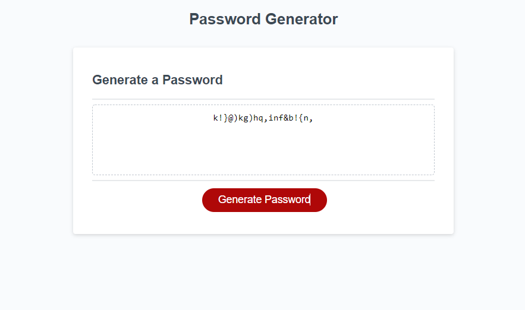

# Password-Generator

## The Project

This project is designed to create a password generator using logical loops between particular criteria chosen by a user. It functions by creating prompts to collect user's information for the design of their custom password allowing some customizability to meet user needs. Comments left for ease of refactor or re-use for any other future projects of similar builds.

## Usage

Simply click the generate password button, answer a few simple questions and voila! Simple, straight forward, effective. My three favorite things!

## Credits

Char codes guide: http:///www.net-comber.com/charset.html

Special thanks to Leo Wong and Christi Scappatura for help reviewing and discussing clean and easy loops.

## Features

**Prompts for user choice of parameters for password.**
**Selection of choices between password length, symbols (special characters), upper case, lower case, and numbers.**
**Pre-emptive prompt to return users if their password length isn't 8 characters minimum or if text is used as input instead of numbers**
